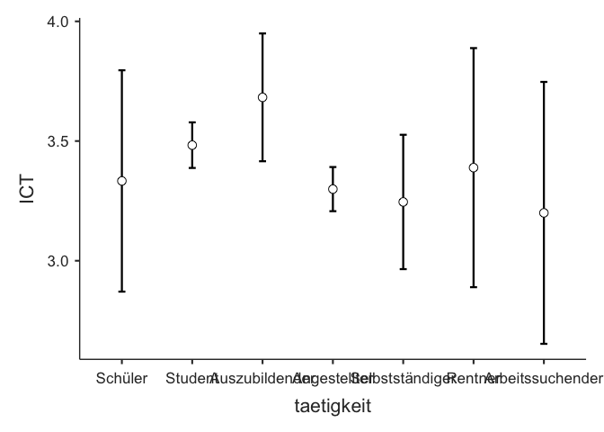
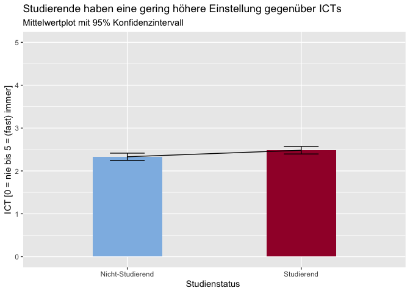

### Es besteht ein Unterschied zwischen Studierenden und Nicht-Studierenden im Hinblick auf die Einstellung gegenüber ICTs.

    datensatz %>%
      ANOVA(dep = "ICT", factors = c("taetigkeit"), effectSize = "partEta", postHoc = ICT ~ taetigkeit, emMeans = ~ taetigkeit, emmPlots = TRUE)

    ## 
    ##  ANOVA
    ## 
    ##  ANOVA                                                                            
    ##  ──────────────────────────────────────────────────────────────────────────────── 
    ##                  Sum of Squares    df     Mean Square    F       p        η²p     
    ##  ──────────────────────────────────────────────────────────────────────────────── 
    ##    taetigkeit              5.26      6          0.877    2.27    0.037    0.034   
    ##    Residuals             151.74    392          0.387                             
    ##  ──────────────────────────────────────────────────────────────────────────────── 
    ## 
    ## 
    ##  POST HOC TESTS
    ## 
    ##  Post Hoc Comparisons - taetigkeit                                                                     
    ##  ───────────────────────────────────────────────────────────────────────────────────────────────────── 
    ##    taetigkeit              taetigkeit          Mean Difference    SE        df     t         p-tukey   
    ##  ───────────────────────────────────────────────────────────────────────────────────────────────────── 
    ##    Schüler            -    Student                     -0.1495    0.2401    392    -0.623      0.996   
    ##                       -    Auszubildender              -0.3492    0.2715    392    -1.286      0.858   
    ##                       -    Angestellter                 0.0341    0.2398    392     0.142      1.000   
    ##                       -    Selbstständiger              0.0877    0.2751    392     0.319      1.000   
    ##                       -    Rentner                     -0.0556    0.3461    392    -0.161      1.000   
    ##                       -    Arbeitssuchender             0.1333    0.3643    392     0.366      1.000   
    ##    Student            -    Auszubildender              -0.1997    0.1441    392    -1.385      0.809   
    ##                       -    Angestellter                 0.1836    0.0674    392     2.723      0.095   
    ##                       -    Selbstständiger              0.2372    0.1507    392     1.574      0.699   
    ##                       -    Rentner                      0.0939    0.2586    392     0.363      1.000   
    ##                       -    Arbeitssuchender             0.2828    0.2824    392     1.001      0.954   
    ##    Auszubildender     -    Angestellter                 0.3833    0.1436    392     2.668      0.109   
    ##                       -    Selbstständiger              0.4369    0.1970    392     2.218      0.288   
    ##                       -    Rentner                      0.2937    0.2880    392     1.020      0.949   
    ##                       -    Arbeitssuchender             0.4825    0.3096    392     1.559      0.709   
    ##    Angestellter       -    Selbstständiger              0.0536    0.1502    392     0.357      1.000   
    ##                       -    Rentner                     -0.0896    0.2583    392    -0.347      1.000   
    ##                       -    Arbeitssuchender             0.0992    0.2822    392     0.352      1.000   
    ##    Selbstständiger    -    Rentner                     -0.1433    0.2914    392    -0.492      0.999   
    ##                       -    Arbeitssuchender             0.0456    0.3127    392     0.146      1.000   
    ##    Rentner            -    Arbeitssuchender             0.1889    0.3767    392     0.501      0.999   
    ##  ─────────────────────────────────────────────────────────────────────────────────────────────────────

    mapping <- c("Angestellter" = "Nicht-Studierend",
                 "Auszubildender" = "Nicht-Studierend",
                 "Selbstständiger" = "Nicht-Studierend",
                 "Rentner" ="Nicht-Studierend",
                 "Arbeitssuchender" = "Nicht-Studierend",
                 "Schüler" = "Nicht-Studierend",
                 "Student"="Studierend")
    datensatz$Studienstatus <- mapping[as.character(datensatz$taetigkeit)]
    datensatz %>%
     filter(!is.na(Studienstatus)) %>% 
     group_by(Studienstatus) %>%
     summarise(ICT_mean = mean(ICT, na.rm = TRUE)-1, 
          count = n(),
          ICT_se = std.error(ICT)) %>%
    mutate(ICT_ci = ICT_se * 1.96) %>%
     ggplot() +
     aes(x = Studienstatus, fill = Studienstatus,
       y = ICT_mean,
       ymin = ICT_mean - ICT_ci,
       ymax = ICT_mean + ICT_ci,
       group = 1) +
     geom_col(fill = c(rwthfarben$lightblue, rwthfarben$bordeaux), width = 0.4) +
     geom_line() +
     geom_errorbar(width = 0.2) + 
     scale_y_continuous(limits = c(0,5), breaks = 0:5) + 
     labs(title = "Studierende haben eine gering höhere Einstellung gegenüber ICTs", 
        subtitle = "Mittelwertplot mit 95% Konfidenzintervall",
        x = "Studienstatus ",
        y = "ICT [0 = nie bis 5 = (fast) immer]", fill = "Studienstatus")

