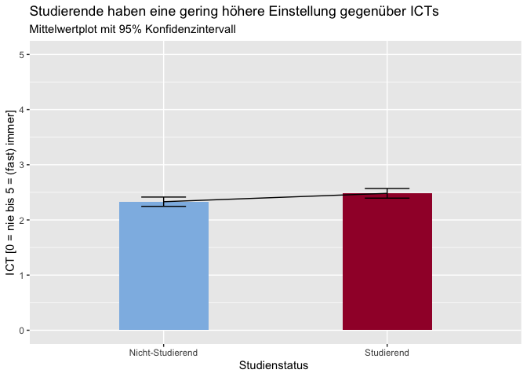

# DigitalSkillsWS1920

### Teammitglieder
- Jill Koester 
- Benasir Wapniarz 
- Carlotta Hohne 

### 1. Forschungsfrage
Inwiefern unterscheiden sich Studierende und Nicht-Studierende in der Ausprägung ihrer digitalen Fähigkeiten?

### 2. Faktorenraum

### 3. Faktoren

Aus dem Paper haben wir folgende Forschungsfrage entwickelt: Inwiefern unterscheiden sich Studierende und Nicht-Studierende in der Ausprägung ihrer digitalen Fähigkeiten?

Wir gehen davon aus, dass heutige Studierende im Laufe ihres Studiums stärker ausgeprägte digitale Fähigkeiten erlangen, als Nicht-Studierende in ihrem Berufs- und Privatleben und es aufgrund dessen zu einem Unterschied in der Ausprägung der digitalen Fähigkeiten Studierender und Nicht-Studierender kommt.

Es sollen zu folgenden Faktoren Items entwickelt werden, die aus dem Paper hervorgehen:

* Informationsfähigkeit 
* Fähigkeit zum kritischen Denken
* Fähigkeit zum Kreativsein
* Problemlösungsfähigkeit
* Kommunikationsfähigkeit
* Kollaborationsfähigkeit

Alle Faktoren sind gleichermaßen relevant, da diese die Gesamtheit der digitalen Kompetenz bilden. Daneben haben wir auch die Einstellung gegenüber der Informations- und Kommunikationstechnik (ICT) erhoben.

### 4. Hypothesen

#### Hypothese 1: Es besteht ein Unterschied zwischen Studierenden und Nicht-Studierenden im Hinblick auf die Einstellung gegenüber ICTs.

In der Stichprobe haben Studierende eine höhere ICT Einstellung als Nicht Studierende. Dieser Unterschied ist signifikant (F(6,392)=2.27, p < .037).

#### Hypothese 2: Es besteht ein Unterschied zwischen Studierenden und Nicht-Studierenden im Hinblick auf die Informationsfähigkeit.

In der Stichprobe haben Studierende eine höhere ICT Einstellung als Nicht Studierende. Dieser Unterschied ist signifikant (F(17.2)=3.40, p < .003).

#### Hypothese 3: Je älter eine Person ist, desto mehr sinkt seine Kommunikationsfähigkeit.

Es gibt einen signifikanten Zusammenhang zwischen Alter und Kommunikationsfähigkeit (τ = -0.208, p < .001). Das bedeutet, dass mit steigendem Alter die Kommunikationsfähigkeit sinkt.

### 5. Fazit und Ausblick

Alle Hypothesen sind vorläufig bestätigt, da Unterschiede zwischen Studierenden und Nicht-Studierenden im Hinblick auf die digitalen Fähigkeiten vorhanden sind. Jedoch müssen weitere Untersuchungen durchgeführt werden, da nur drei der sieben Digital Skills deskriptiv und inferenzstatistisch ausgewertet wurden. Die Forschungsfrage ist somit nicht hinreichend beantwortbar. Für eindeutige Ergebnisse müssen alle Digital Skills in Betracht gezogen werden und die Ausprägungen in den verschiedenen Gruppen analysiert werden.
