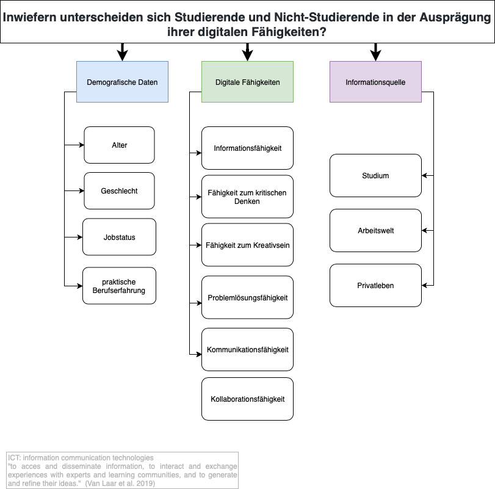

# DigitalSkillsWS1920

## Teammitglieder
- Anna Abel 
- Jill Koester 
- Michelle Gerhardt 
- Benasir Wapniarz 
- Carlotta Hohne 

## 1. Forschungsfrage
Inwiefern unterscheiden sich Studierende und Nicht-Studierende in der Ausprägung ihrer digitalen Fähigkeiten?

## 2. Faktorenraum

### 3. Faktoren

Aus dem Paper haben wir folgende Forschungsfrage entwickelt: Inwiefern unterscheiden sich Studierende und Nicht-Studierende in der Ausprägung ihrer digitalen Fähigkeiten?

Wir gehen davon aus, dass Studierende im Laufe ihres Studiums stärker ausgeprägte digitale Fähigkeiten erlangen, als Nicht-Studierende in ihrem Berufs- und Privatleben und es aufgrund dessen zu einem Unterschied in der Ausprägung der digitalen Fähigkeiten Studierender und Nicht-Studierender kommt. Deshalb erheben wir zusätzlich die Faktoren der Informationsquellen Studium, Arbeitswelt und Privatleben.

Weiter gehen wir davon aus, dass Studierende ihre digitalen Fähigkeiten zum Großteil im Laufe ihres Studiums durch modernisierte Bildungsmaßnahmen erlangen. Der eigentliche Fokus liegt jedoch auf der Fragestellung, inwiefern ein Unterschied in der Ausprägung der digitalen Fähigkeiten vorliegt.

Es sollen zu folgenden Faktoren Items entwickelt werden, die aus dem Paper hervorgehen:

* Informationsfähigkeit 
* Fähigkeit zum kritischen Denken
* Fähigkeit zum Kreativsein
* Problemlösungsfähigkeit
* Kommunikationsfähigkeit
* Kollaborationsfähigkeit

Alle Faktoren sind gleichermaßen relevant, da diese die Gesamtheit der digitalen Kompetenz bilden. 

#### 4. Hypothesen

# Hypothese 1: 

Frauen sind konsequenter bei der Benennung von digitalen Dateien als Männer.
Verfahren: T-Test
H0 = Frauen und Männer unterscheiden sich nicht bei der Benennung von digitalen Dateien.
H1 = Frauen und Männer unterscheiden sich bei der Benennung von digitalen Dateien.

# Hypothese 2: 

Männer mit einer abgeschlossenen Ausbildung prüfen eher Informationen auf anderen Website gegen als Männer ohne eine abgeschlossene Ausbildung. 
Verfahren: Anova
H0 = Männer mit einer abgeschlossenen Ausbildung unterscheiden sich nicht von Männer ohne eine abgeschlossene Ausbildung bei der Gegenprüfung von Informationen auf anderen Websites.
H1 = Männer mit einer abgeschlossenen Ausbildung unterscheiden sich von Männer ohne eine abgeschlossene Ausbildung bei der Gegenprüfung von Informationen auf anderen Websites.

# Hypothese 3: 

Männer verbinden sich öfter online mit Menschen aus Ihrem Fachbereich als Frauen.
Verfahren: t-Test
H0 = Männer und Frauen unterscheiden sich nicht bei der Online Verbindung mit Menschen aus Ihrem Fachbereich.
H1 = Männer und Frauen unterscheiden sich bei der Online Verbindung mit Menschen aus Ihrem Fachbereich.

# Hypothese 4:

Frauen nutzen eher das Internet, um innovative Ideen für Ihre Arbeit/Ihr Studium zu generieren.
Verfahren: t-Test
H0 = Frauen und Männer unterscheiden sich nicht bei der Internetnutzung, um innovative Ideen für Ihre Arbeit/Ihr Studium zu generieren.
H1 = Frauen und Männer unterscheiden sich bei der Internetnutzung, um innovative Ideen für Ihre Arbeit/Ihr Studium zu generieren.

# Hypothese 5: 

Männer nehmen eher an Diskussionen über Internet Anwendungen teil als Frauen.
Verfahren: t-Test
H0 = Männer und Frauen unterscheiden sich nicht bei der Teilnahme an Diskussionen über Internet Anwendungen.
H1 = Männer und Frauen unterscheiden sich bei der Teilnahme an Diskussionen über Internet Anwendungen.
